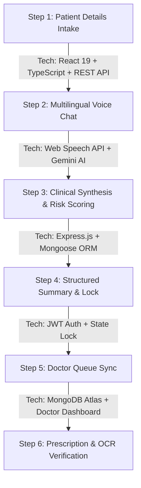
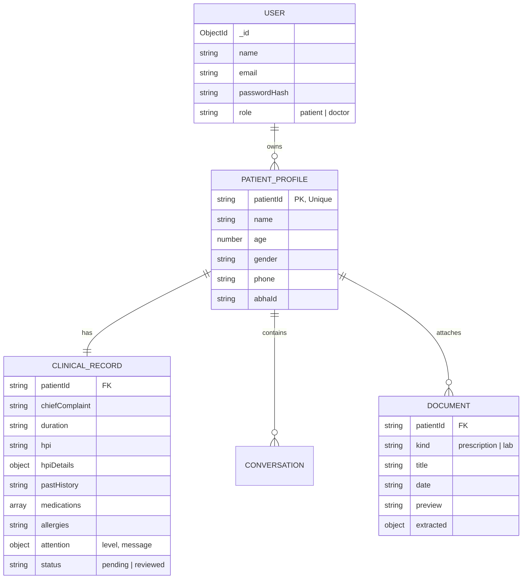

# 🏥 AAROGYA — SIH Presentation Deck & Project Documentation

> **Smart India Hackathon (SIH) Official Presentation Format**
> **Project Name**: AAROGYA — Next-Gen AI Clinical Intake & Doctor Decision Support System  
> **Domain**: MedTech / Healthcare & Biomedical Devices  
> **Tech Stack Summary**: React 19 + TypeScript + Node.js Express + MongoDB Atlas + Google Gemini AI  
> **GitHub Repository**: [https://github.com/gauravtiwari111/aarogya-sih](https://github.com/gauravtiwari111/aarogya-sih)

---

## 📌 Slide 1: Title Slide
* **Project Title**: AAROGYA — Technology for Better Health & Streamlined OPD Workflow
* **Tagline**: Intelligent Clinical Intake, Multilingual Voice Symptom Assessment, and Real-Time Doctor Decision Support
* **Target Impact**: Primary Health Centres (PHCs), Super-Specialty OPDs, and Rural Telemedicine
* **Live Prototype**:
  * **Frontend (Vite + React 19)**: `http://localhost:5173/`
  * **Backend (Node.js + REST API)**: `http://localhost:5000/api`
  * **Cloud Database**: MongoDB Atlas Cluster0 (`aarogya`)

---

## ⚠️ Slide 2: Problem Statement & Real-World Challenges

1. **OPD Overcrowding & Doctor Burnout**:
   * Doctors in Indian hospitals spend **over 70% of consultation time** manually taking basic medical history (Name, Age, Duration, Symptoms, Past History).
   * Average consultation time per patient is reduced to under 3 minutes, leading to potential diagnostic omissions.

2. **Unstructured & Lost Medical Records**:
   * Patients carry handwritten paper prescriptions that are frequently misplaced or unreadable.

3. **Language & Accessibility Barriers**:
   * Rural patients struggle to communicate complex medical symptoms in English or type long technical medical terms.

4. **Delayed Critical Triage**:
   * High-risk emergencies (e.g., exertional chest pain, sudden dyspnea) wait in the same OPD queue as mild seasonal coughs.

---

## 💡 Slide 3: Proposed Solution — AAROGYA Platform

AAROGYA transforms the traditional OPD workflow into an **AI-augmented 2-step clinical pipeline**:

```
[Patient Intake Portal] ➔ [AI Symptom & Voice Assessment] ➔ [Real-Time Risk Triage] ➔ [Structured Clinical Summary] ➔ [Doctor Review Dashboard]
```

1. **Pre-Consultation Patient Intake**: Patients fill demographics & communicate symptoms via **Voice (Hindi/English)** or tap-options before meeting the doctor.
2. **Adaptive AI Follow-Up**: Google Gemini AI asks smart follow-up questions tailored to symptoms (e.g., duration, severity, radiation of pain).
3. **Automated Clinical History Generation**: Generates structured HPI (History of Present Illness), Past History, Allergies, Medications, and ICD-10 suggested codes.
4. **Instant Doctor Queue & Triage**: Doctors see a prioritized queue (Critical / High / Mild / Low risk) with instant 1-page clinical summaries, cutting consultation time by 60%.

---

## 🛠️ Slide 4: Complete Technology Stack

| Layer | Technologies & Tools | Description / Role |
| :--- | :--- | :--- |
| **Frontend Framework** | `React 19`, `TypeScript`, `Vite 8` | Modern SPA with ultra-fast HMR and type safety |
| **Styling & UI** | `Tailwind CSS v4`, `Framer Motion`, `Lucide Icons` | Glassmorphism UI, accessible dark/light themes, animations |
| **Accessibility (A11y)** | `Web Speech API`, SpeechSynthesis, Dynamic Scaling | Voice input, read-aloud prompts, high-contrast modes |
| **Backend API** | `Node.js v24`, `Express.js` | Modular REST API with route controllers & middleware |
| **Security & Auth** | `JWT (JSON Web Tokens)`, `Bcrypt.js`, `Cors`, `Helmet` | Encrypted passwords, role-based protection (Patient vs Doctor) |
| **Database** | `MongoDB Atlas` + `Mongoose ORM` | Distributed cloud database with schema validation |
| **Offline Safety** | `MongoDB Memory Server` | Zero-dependency local fallback for instant offline demos |
| **AI Clinical Engine** | `Google Gemini API` + Rule Engine | Dynamic symptom questioning, triage risk assessment |
| **Deployment** | `Vercel` (Frontend) + `Render` (Backend API) | Production cloud hosting with automatic CI/CD |

---

## 🔄 Slide 5: Step-by-Step Workflow & Tech Stack Per Step



### Detailed Breakdown of Workflow Steps:

#### 1️⃣ Step 1: Patient Demographic Registration
* **User Action**: Patient enters Name, Age, Gender, Phone Number, and ABHA (Ayushman Bharat Health Account) ID.
* **Tech Stack Used**: `React 19`, `HTML5 Form Validation`, `REST API (PUT /api/patients/profile)`.
* **Database Action**: Creates initial `PatientProfile` document in MongoDB Atlas.

#### 2️⃣ Step 2: Adaptive AI Symptom Intake & Voice Assessment
* **User Action**: Patient types or speaks symptoms in English or Hindi (e.g., *"2 din se seene me dard ho raha hai"*).
* **Tech Stack Used**: `Web Speech API (SpeechRecognition & SpeechSynthesis)`, `Google Gemini REST API`, `AppContext`.
* **Features**: Tap options for low-literacy users, audio repeat button, live transcript generator.

#### 3️⃣ Step 3: Real-Time Risk Triage & Clinical Assessment
* **System Action**: AI evaluates symptoms, past medical history, and red flags to assign a Triage Risk Level (**Mild**, **Moderate**, **High**, **Critical**).
* **Tech Stack Used**: `Express.js Controller`, `aiService.js (Gemini API + Rule Engine Fallback)`.
* **Output**: Generates structured HPI details (Onset, Location, Character, Duration, Aggravating & Relieving factors).

#### 4️⃣ Step 4: Patient Summary Review & Account Lock
* **User Action**: Patient reviews their generated summary and clicks *"Submit to Doctor Queue"*.
* **Tech Stack Used**: `React 19`, `REST API (PUT /api/patients/profile)`, `State Guard`.
* **Security Action**: Patient session locks post-submission so patients cannot access or tamper with doctor medical queues.

#### 5️⃣ Step 5: Doctor Review Dashboard & Live Queue Sync
* **User Action**: Authorized Doctor logs in using Doctor Credentials (`doctor@aarogya.com` / `DoctorPass123!`).
* **Tech Stack Used**: `JWT Authentication`, `Protected Middleware (`protect`)`, `MongoDB Atlas queries`.
* **Doctor Features**: Triage status badges, chief complaint summary, past history, medications list, and 1-click clinical approval.

#### 6️⃣ Step 6: OCR Medical Document Extraction
* **User Action**: Patient/Nurse uploads past paper prescriptions or lab reports.
* **Tech Stack Used**: `documentService.ts`, `RegEx Medical Parser Engine`, `Document Mongoose Schema`.
* **Output**: Extracts Doctor Name, Clinic, Prescribed Medicines, and Lab Values (e.g., HbA1c 5.8%, Cholesterol 210 mg/dL).

---

## 🗄️ Slide 6: Database Collections Schema (MongoDB Atlas)



---

## ⭐ Slide 7: Unique Selling Points (USPs) & SIH Innovation

1. **Zero-Wait Dual-Mode Architecture**:
   * Works on Cloud MongoDB Atlas **AND** falls back seamlessly to `MongoMemoryServer` if internet is disconnected, ensuring **100% demo uptime** during hackathon judging.

2. **Built for Bharat (Vernacular & Audio First)**:
   * Native Hindi & English voice recognition & speech synthesis for rural healthcare adoption.

3. **Strict Role-Based Access Control (RBAC)**:
   * Patient & Doctor portals are completely segregated with JWT authentication and post-submission data locking.

4. **Ayushman Bharat (ABDM / ABHA) Ready**:
   * Pre-structured for ABHA 14-digit health ID linking and digital OPD integration.

5. **AI + Clinical Fallback Safety Engine**:
   * Uses Gemini AI when online, but switches to a deterministic medical decision tree offline to prevent AI hallucinations or downtime.

---

## 📈 Slide 8: Feasibility, Scalability & Impact Metrics

* **Consultation Time Reduction**: Cuts average OPD history-taking time from **10 minutes to under 2 minutes**.
* **Diagnostic Accuracy**: Ensures zero missing red-flag warnings (e.g., chest pain duration, allergies).
* **Cost Efficiency**: Built 100% using open-source web technologies and cloud free-tiers (Vercel, Render, MongoDB Atlas).
* **Scalability**: Can be integrated into existing hospital HMIS (Hospital Management Information System) via REST APIs.

---

## 🚀 Slide 9: Future Roadmap

1. **IoT Vitals Monitor Sync**: Connect Bluetooth Pulse Oximeters, BP Cuffs, and ECG patches for live vitals triage.
2. **Regional Vernacular Audio Models**: Support for Tamil, Telugu, Bengali, Marathi, and Gujarati speech.
3. **E-Sanjeevani Telemedicine Integration**: Direct integration with Govt. of India E-Sanjeevani portal.

---

## 🎯 Slide 10: Conclusion & Live Presentation Command Guide

* **Project Repository**: [github.com/gauravtiwari111/aarogya-sih](https://github.com/gauravtiwari111/aarogya-sih)
* **Local Run Commands**:
  ```bash
  # 1. Start Backend API (Port 5000)
  cd backend
  npm start

  # 2. Start Frontend App (Port 5173)
  npm run dev
  ```

---
*Created for Smart India Hackathon (SIH) Evaluation — AAROGYA Team.*
